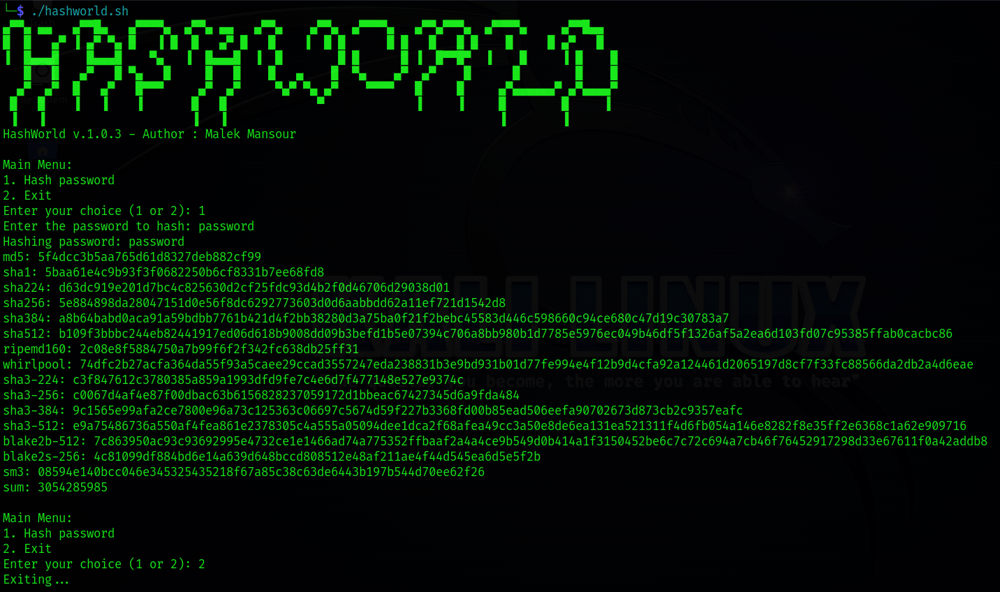

# HashWorld

HashWorld is a command-line tool written in Bash that allows you to quickly hash passwords using various algorithms. It provides a simple interface to hash passwords and view the hashed values for different hashing algorithms.



## Features

- Supports multiple hashing algorithms, including MD5, SHA-1, SHA-224, SHA-256, SHA-384, SHA-512, and more.
- Displays the hashed password for all supported algorithms.
- Simple and user-friendly interface.
- Securely hashes passwords using industry-standard algorithms.

## Requirements

- Bash (version 4 or higher)

## Usage

1. Clone the repository or download the `hashworld.sh` script.
    ```
    git clone https://github.com/MalekMansour/HashWorld.git
    ```
2. Open a terminal and navigate to the directory where the `hashworld.sh` script is located.
3. Make the script executable by running the following command:

    ```bash
    chmod +x hashworld.sh
    ```

5. Run the script by executing the following command:

    ```bash
    ./hashworld.sh
    ```

6. The script will display the main menu with the following options:
   - Hash password: Enter a password and view the hashed values for different algorithms.
   - Exit: Quit the program.

7. Choose the "Hash password" option and follow the prompts to enter a password.
8. Once the password is entered, the script will display the hashed password for all supported algorithms.
